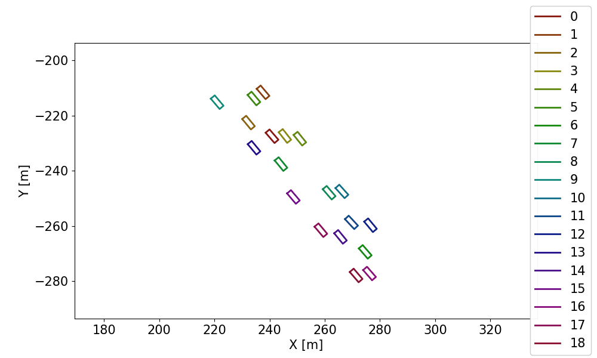
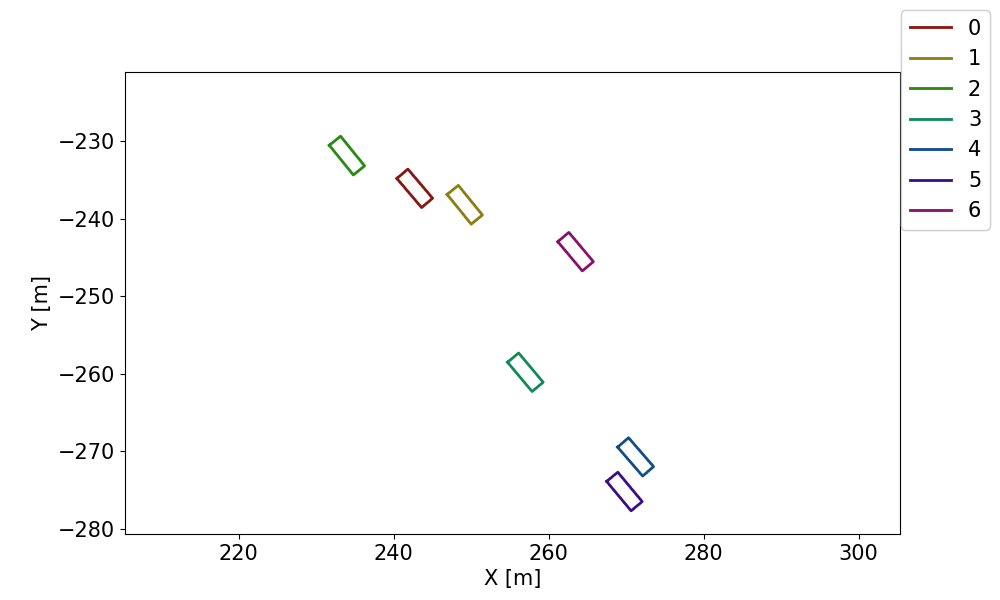

## Introduction
This project demonstrated the usage of clustering algorithm to automaticall extract racing battles from racecar telemetry data. The purpose is to automatically generate segment of interests from all available data and provided as datasets for detailed analysis. This eliminated the needs to manually select data segments and reduced data analysis efforts on out of interest data. The framework utilized a couple of hyperparameters which are interpretable with respect the racing battle definition, such as the distance between cars that are currently battling with each other. 

Code can be found [here](!https://github.com/ylin62/Clustering-Study/tree/master/scripts).

## Demo of extracted battles

 

## Overview

What this does is taking the trajectory data of a group of vehicles, and at each time stamp, a hierarchical clustering model with user defined hyperparameters will do the clustering. After this step each time stamp will associate with clusters of vehicles, and along timeline, each cluster is tracked with its generation or termination. Thus at the end a time-series of user defined clusters will be generated as results. Each cluster represent a racing battle the last for a certain period of time, from the generation of the cluster to the termination. This can be used to track a certain group of battle, including cars that join or leave the cluster if the user has a certain vehicle to monitor. 